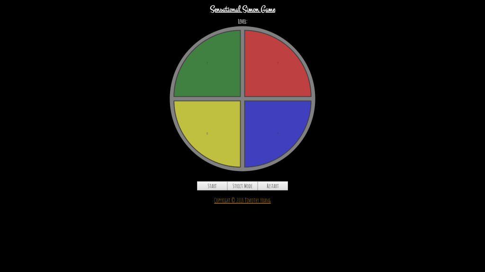
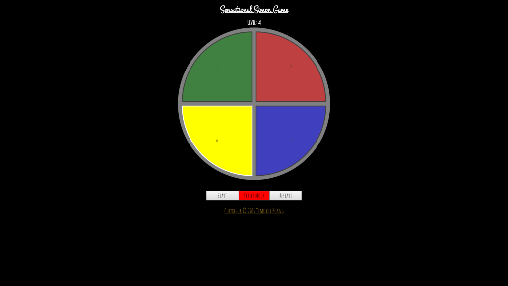

# 0031_simon_game

<figure></figure>

## To view this app online
- To view deployed app, visit: https://timh1203.github.io/simon-game

## To edit the source code
- Github Repo: https://github.com/timh1203/simon-game
1. Have NPM and NodeJS installed on your computer
2. Navigate to the directory of choice and type `git clone https://github.com/timh1203/simon-game`
3. Alternatively, you can also fork the repo and clone it (no future updates planned)
4. Open up your favorite editor and have fun!

## About
- [Simon Game](https://en.wikipedia.org/wiki/Simon_(game)) is a memory game released in 1978
- A solo game that tests the player's ability to remember a sequence and repeat the pattern
- By beating level 20, the player wins the game
- This game is designed for anyone who wants to test their memory skills
- Currently: final stage, no more future updates planned (as of 3/13/2018)

## Features
- Play this old-school game with a musical theme and colors
- Option to turn on strict mode which starts with a fresh sequence if user repeats a sequence incorrectly
- Ability to turn on strict mode at any point
- Ability to reset the game at any point
- Key mappings of number pad to play the game with keyboard

## Minor Features
- Keyboard `1` key for top-left, green button
- Keyboard `2` key for top-right, red button
- Keyboard `3` key for bottom-left, yellow button
- Keyboard `4` key for bottom-right, blue button
- Keyboard `Spacebar` key to start the  game
- Keyboard `Enter` key to reset the current game
- Keyboard `0` key to toggle strict mode

## App flow
1. Decide if you want to play normal or strict mode (click "Strict Mode" or keyboard `0` key)
2. Start the game by pushing start or the `Spacebar` key
3. Listen and look at the memory sequence
4. Click or input (keyboard `1`, `2`, `3`, `4` keys) the correct sequence once the memory sequence finishes
5. If incorrect input, the sequence will replay (non-strict mode) or restart the whole game (strict mode)
6. If correct input, the game will replay the same sequence and add an additional pattern (both modes)
7. Once you have completed level 20 and correctly repeated 20 patterns, you will win and receive a fanfare
8. Restart the game at anypoint if desired (click "Restart" or keyboard `Enter` key)

## Technologies for this project
- HTML
- CSS
- JavaScript
- ReactJS (Create-React-App)
- Sound effects from [FreeSound](https://freesound.org/)

## More pictures
### Strict Mode On
<figure></figure>

